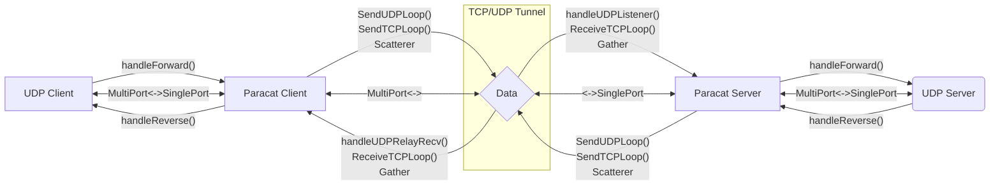

# ParaCat: A multipath UDP forwarder for high reliability/throughput

In crowded Internet, all connections are not reliable. To minimize jitter and packet loss, we can send it through different routes simultaneously then get redundancy.

## Structure

## TODO

- [X] Round-robin mode
- [X] Remove unused UDP connections
- [X] Re-connect after EOF
- [X] GRO & GSO
- [ ] Single direction for connection
- [X] CRC check
- [ ] New udp socket for each connection
- [ ] UDP MTU discovery with DF
- [ ] Routing strategy
- [ ] API interface
- [ ] Heartbeat keepalive
- [ ] Optimize delay
- [ ] Congestion control algorithm
- [ ] Fake TCP with eBPF
- [ ] Test coverage
- [ ] Multi-user support
