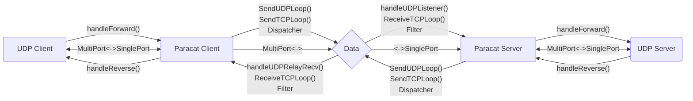

# ParaCat: A multipath UDP forwarder for high reliability/throughput

In crowded Internet, all connections are not reliable. To minimize jitter and packet loss, we can send it through different routes simultaneously then get redundancy.

## Structure

## TODO

- [X] Round-robin mode
- [X] Remove unused UDP connections
- [X] GRO & GSO
- [ ] Optimize delay
- [ ] Re-connect after EOF
- [ ] Congestion control algorithm
- [ ] Fake TCP with eBPF
- [ ] UDP MTU discovery with DF
- [ ] API interface
